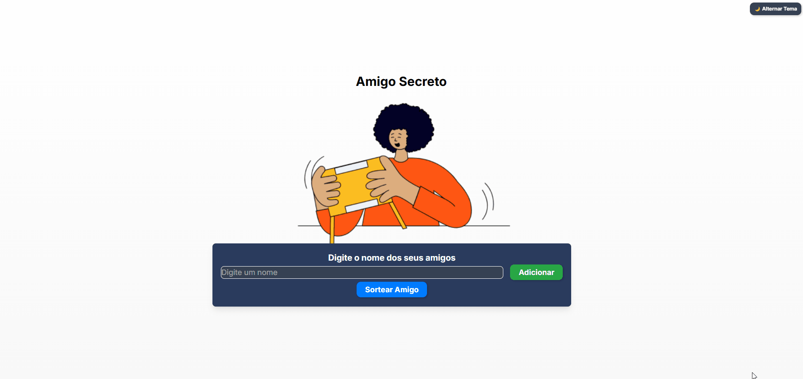

# Amigo Secreto 🎉

Este projeto é uma aplicação simples de **Amigo Secreto**, onde os usuários podem adicionar nomes à lista e realizar um sorteio aleatório para escolher um participante.

## 📌 Funcionalidades

- **Adicionar nomes**: Os usuários podem inserir nomes em um campo de entrada e adicioná-los à lista clicando no botão "Adicionar".
- **Validar entrada**: O sistema impede a adição de nomes vazios, garantindo que apenas entradas válidas sejam registradas.
- **Visualizar lista**: Os nomes adicionados são exibidos em uma lista abaixo do campo de entrada.
- **Sortear um amigo**: Um botão permite sortear aleatoriamente um nome da lista e exibi-lo na tela.
- **Tema escuro (Dark Mode)**: Implementação do modo escuro utilizando Tailwind CSS, permitindo que os usuários alternem entre os temas claro e escuro através de um botão dedicado.
- **Modo responsivo**: A interface adapta-se automaticamente a diferentes tamanhos de tela, proporcionando uma experiência otimizada em dispositivos móveis, tablets e desktops.

## 🎥 Demonstração

### Teste do Front-end


### Alternando entre temas:


## 🚀 Como executar o projeto

1. Faça o clone do repositório:
   ```sh
   git clone https://github.com/titi0001/challenge-amigo-secreto
   ```
2. Acesse a pasta do projeto:
   ```sh
   cd amigo-secreto
   ```
3. Abra o arquivo `index.html` no navegador.

## 💂️️ Estrutura do projeto
```
💂️️ amigo-secreto
├── 📝 index.html      # Estrutura principal da aplicação
├── 📝 style.css       # Estilos da página
├── 📝 app.js          # Lógica e interatividade
├── 📂 assets          # Imagens e ícones
├── 📝 README.md       # Documentação do projeto
└── 📂 test            # Gif´s do projeto
    ├── 📝             # sorteio.gif
    └── 📝             # change-mode.gif
```

## 📛 Tecnologias utilizadas
- **HTML**: Estrutura da aplicação.
- **Tailwind CSS**: Estilização e suporte ao tema escuro.
- **JavaScript**: Lógica para adicionar nomes, realizar o sorteio e alternar entre os temas.

---
📌 **Divirta-se com seu Amigo Secreto!** 🎁

